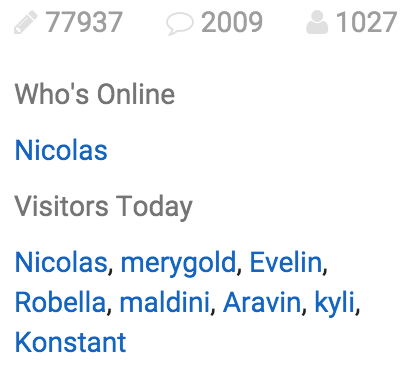

# NodeBB Widget: Stats

Overall stats about life on the forum. Some metrics are number of posts, users, topics. Also several additional user related features like - currently online users and who have visited today.

<!-- START doctoc generated TOC please keep comment here to allow auto update -->
<!-- DON'T EDIT THIS SECTION, INSTEAD RE-RUN doctoc TO UPDATE -->
 

- [Preview](#preview)
- [Implementation](#implementation)

<!-- END doctoc generated TOC please keep comment here to allow auto update -->

## Preview

## Implementation

- Users are sorted by `username` in online list
- Users are sorted by time of appearance in today list
- Online list response is cached for 60 seconds
- Online list is limited to 128 records
- Online status is true, if user was around for last 15 minutes
- General stats are cached for 1 day
